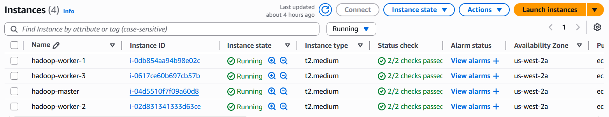
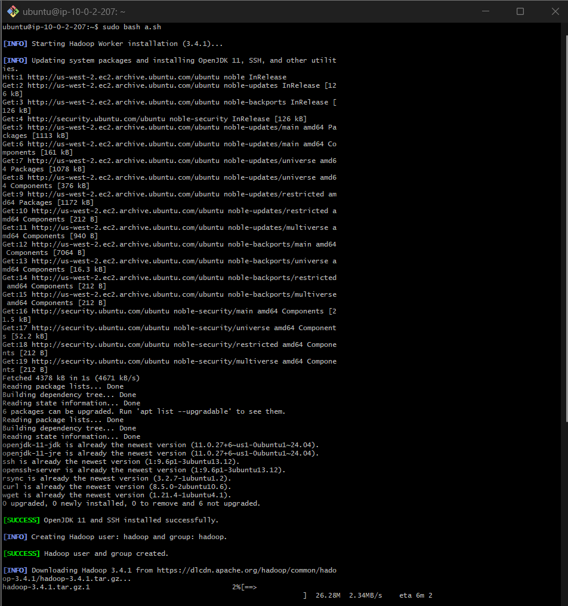
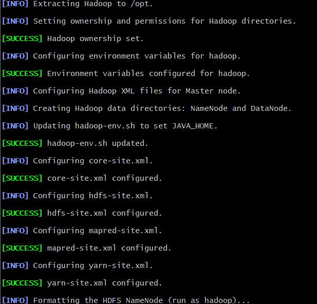
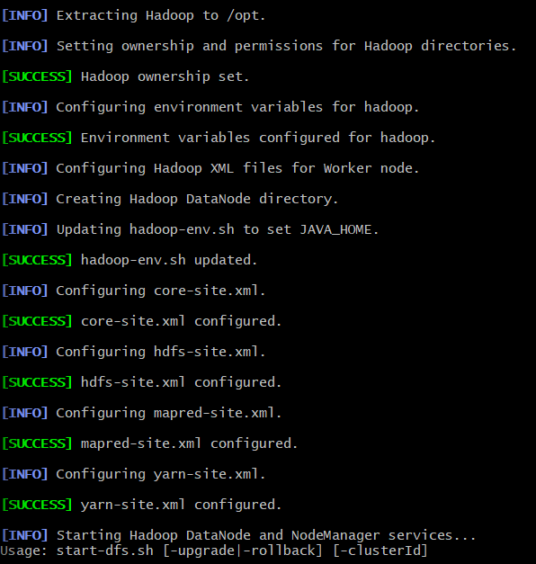
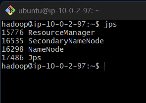
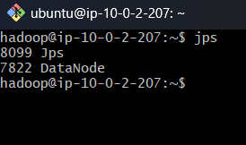

# Hadoop & Spark Job Market Analysis

## University of Ruhuna - Faculty of Engineering

### Assignment 1 - Semester 7 (May 2025)

### Module: Cloud Computing (EC7205)

## Team Members

1. Jayasooriya L.P.M (EG/2020/3990)
2. Jayathilake H.A.C.P (EG/2020/3994)
3. Jayawardhana M.V.T.I (EG/2020/3996)

## 🔗 Project Links

- Website: [Hadoop Cluster Manager](https://pramithamj.github.io/hadoop-cluster-manager/)
- GitHub Repository: [Hadoop Cluster Manager GitHub](https://github.com/pramithamj/hadoop-cluster-manager)
- Kaggle Dataset: [Job Description Dataset](https://www.kaggle.com/datasets/ravindrasinghrana/job-description-dataset/data)

## Project Overview

This comprehensive project analyzes job market data using both Hadoop MapReduce and Apache Spark frameworks. The analysis focuses on two key aspects:

1. **Technical Skills Analysis**: Identifies the most in-demand technical skills in the job market by extracting and counting skills mentioned in job descriptions.
2. **Salary Analysis**: Analyzes salary information across different job titles to identify trends, high-paying roles, and salary distributions.

## Apache Hadoop Cluster Installation Guide

To simplify running Hadoop clusters, we developed a custom web-based tool: **Hadoop Cluster Manager**.

- Easily install Hadoop
- Manage clusters via a user-friendly interface
- Automates common admin operations

For full instructions and live demo: [Website Link](https://pramithamj.github.io/hadoop-cluster-manager/)

gitHub Link : [hadoop-cluster-manager](https://github.com/pramithamj/hadoop-cluster-manager)

## AWS cluster setup for hadoop

To run the hadoop cluster on aws with one master node and 3 data nodes, the terraform automation is done to provision and setup the resources in folder [text](aws-cloud-deployment)



EC2s provisionsed in AWS


Installing Hadoop on master



Install Hadoop on worker



Configure Hadoop on master node



Configure Hadoop on worker node



Hadoop running on the master node



Hadoop running on a worker node


## Repository Structure

- `src/` - Java source code for MapReduce implementation

  - `SkillsAnalyzer.java` - Driver class for the MapReduce job
  - `SkillsMapper.java` - Mapper implementation for extracting skills
  - `SkillsReducer.java` - Reducer implementation for aggregating skill counts
- `input/` - Input data directory

  - `job_descriptions.csv` - Dataset with job postings
- `conf/` - configuration of hadoop
- `python_version/` - python version of the hadoop mapreducer
- `screenshots_and_log` - sceenshot and log of the analysis
- `output/` - Generated output from MapReduce job
- `build_salary.md` - Builds the salary analysis MapReduce job
- `build_spark.sh` - Builds the Spark analysis jobs
- `build.sh` - Script to compile code and build JAR
- `run_local.sh` - Script to run the job in local mode
- `generate_comprehensive_report.sh` - Script to generate conmprehensive report
- `generate_report.sh` - Script to generate a summary report of results
- `generate_salary_report.sh` - Generates a basic report for the salary analysis
- `generate_spark_report_simple.sh` - Generates reports for Spark-based analysis
- `generate_spark_report.sh` - Generates reports for Spark-based analysis
- `capture_evidence.sh` - Script to capture evidence of execution
- `PROJECT_README.md` - Detailed technical documentation
- `PROJECT_SUMMARY.md` - Summary of project and findings
- `COMPREHENSIVE_SALARY_REPORT.md` - Detailed salary analysis from MapReduce
- `RESULTS_ANALYSIS.md` - Analysis of the skills frequency results
- `PROJECT_STRUCTURE.md` - Details Stucture of the project
- `RESULTS_ANALYSIS.md` - In-depth analysis of results
- `SPARK_salary_ANALYSIS_REPORT.md` - Spark implementation of the salary analysis
- `SPARK_SKILLS_ANALYSIS_REPORT.md` - Spark implementation of the skill analysis
- `USAGE_GUIDE.md` - Comprehensive usage instructions for all scripts
- `execution_log.txt` - Log of MapReduce job execution
- `skills-analyzer.jar` - Compiled MapReduce application
- `SALARY_ANALYSIS_REPORT.md` - Basic salary statistics report
- `run_local.sh` - Runs the skills analysis in local mode
- `run_salary_analysis.sh` - Comprehensive script for running the salary analysis with detailed output
- `run_salary.sh` - Comprehensive script for running the salary analysis with detailed output
- `run_spark_analysis.sh` - Runs either salary or skills analysis in Spark
- `run_spark_simulation.sh` - Generates reports for Spark-based analysis

## Quick Start Guide

### Prerequisites

- Java 11 or higher
- Hadoop 3.x
- Apache Spark 3.x (optional, simulation mode available)

### Running the Analysis

#### Hadoop MapReduce Analysis

```bash
# Build the salary analyzer
./build_salary.sh

# Run the salary analysis
./run_salary_analysis.sh input/job_descriptions.csv output/full_salary_analysis

# Generate comprehensive report
./generate_comprehensive_report.sh output/full_salary_analysis
```

#### Apache Spark Analysis (with Spark installed)

```bash
# Build the Spark analyzer
./build_spark.sh

# Run the Spark salary analysis
./run_spark_analysis.sh salary input/job_descriptions.csv output/spark_salary_analysis

# Generate the Spark report
./generate_spark_report_simple.sh salary output/spark_salary_analysis
```

#### Apache Spark Analysis (simulation mode)

```bash
# Run the Spark simulation
./run_spark_simulation.sh salary input/job_descriptions.csv output/spark_salary_analysis

# Generate the Spark report
./generate_spark_report_simple.sh salary output/spark_salary_analysis
```

### Viewing Reports

The reports are generated in markdown format and can be viewed in any markdown viewer:

- `COMPREHENSIVE_SALARY_REPORT.md`: Hadoop-based salary analysis
- `SPARK_SALARY_ANALYSIS_REPORT.md`: Spark-based salary analysis
- `SPARK_SKILLS_ANALYSIS_REPORT.md`: Spark-based skills analysis

## Detailed Documentation

For comprehensive documentation on all scripts and workflows:

- `USAGE_GUIDE.md`: Complete usage instructions for all scripts
- `PROJECT_SUMMARY.md`: Technical overview and results summary
- `PROJECT_README.md`: Detailed technical implementation details

## Key Features

- Dual implementation using both Hadoop MapReduce and Apache Spark
- Comprehensive salary analysis across job titles
- Technical skills frequency analysis with filtering
- Detailed report generation
- Simulation mode for environments without Spark
- Bash scripts for automation of the entire workflow

## Screenshots and Evidence

The `screenshots/` directory contains evidence of execution, including:

- Terminal outputs
- Directory structures
- File listings
- Sample results

## License

This project is developed for educational purposes as part of the EC7205 Cloud Computing module.

## Dataset Description

We used a job descriptions dataset containing detailed information about job postings, including:

- Job titles and descriptions
- Required skills and qualifications
- Company information
- Salary ranges
- Job locations and other metadata

The dataset contains over 100,000 records and is approximately 1.7GB in size, stored in CSV format. Key columns used in our analysis include:

- Column 14: Job Title
- Column 17: Job Description
- Column 19: Skills

## How to Run

### Prerequisites

- Java JDK 11 or higher
- Hadoop 3.4.1 installed and configured
- CSV dataset in the input directory

### Steps

1. **Build the project**

   ```bash
   ./build.sh
   ```
2. **Run in local mode**

   ```bash
   ./run_local.sh
   ```
3. **Generate a report**

   ```bash
   ./generate_report.sh
   ```
4. **Capture execution evidence**

   ```bash
   ./capture_evidence.sh
   ```


---
## Results analysis

The results analysis is done in the following files:

[text](COMPREHENSIVE_SALARY_REPORT.md)
[text](RESULTS_ANALYSIS.md)
[text](SALARY_ANALYSIS_REPORT.md)
[text](SPARK_salary_ANALYSIS_REPORT.md)
[text](SPARK_SKILLS_ANALYSIS_REPORT.md)


*This project was completed as part of the Cloud Computing (EC7205) course at the University of Ruhuna, Faculty of Engineering.*
